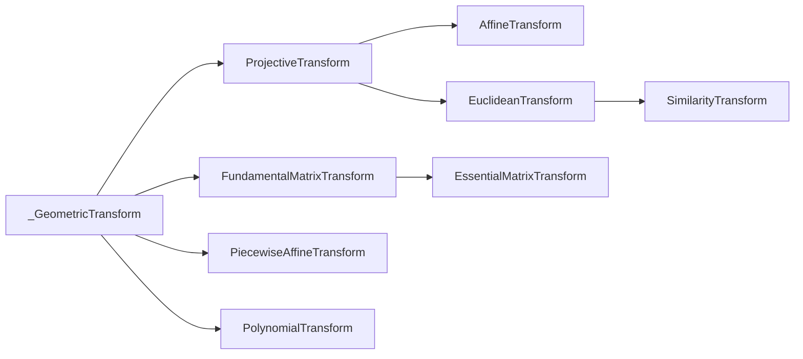

用skimage的时候有点想不明白，干脆review了一下[源代码](https://github.com/scikit-image/scikit-image/blob/v0.22.0/skimage/transform/_geometric.py)。不多废话直接上菜

# `Class _GeometricTransform`

几何变换。
包含于`transform._geometric`中
继承于`abc.ABC`.
```python
>>> import abc
>>> abc.__doc__
'Abstract Base Classes (ABCs) according to PEP 3119.'
```
从抽象基类之中继承而来。
定义接口`__call__(self,coords) return coords`参数包含变换前后的坐标
定义接口`inverse(self)`（逆运算）和`residuals(self, src, dst)`（残差运算，计算变换的误差，返回源坐标和目标坐标的方差）

# `Class  ProjectiveTransform`

投影变换。

继承自`_GeometricTransform`

数学表示为一个3x3的矩阵。

对一个齐次坐标$\mathbf{x} = [x, y, 1]^T$，应用如下的变换矩阵：
$$
\begin{bmatrix}
a_0&a_1&a_2\\
b_0&b_1&b_2\\
c_0&c_1&1
\end{bmatrix}
$$
可以表示**平移、旋转、缩放、错切、透视投影**等各种几何变换。

其中储存的属性为`self.params`，具体存储了一个正交变换矩阵，即维数+1的方阵。

初始化传入参数为如上的矩阵及可选的维数（仅当传入的matrix为空时，利用维数创造一个恒等变换矩阵）。

如果需要打印矩阵可以按需调取`__nice__ __repr__ __str__`这几种方法

它 和它的继承类都实现了`estimate(self,src,dst)`这个方法，用于估测变换是否

# `Class AffineTransform`

仿射变换。

继承自`ProjectiveTransform`

仿射变换有如下的形式：

```python
X = a0 * x + a1 * y + a2
  =   scale_x * x * [cos(rotation) + tan(shear_y) * sin(rotation)]
    - scale_y * y * [tan(shear_x) * cos(rotation) + sin(rotation)]
    + translation_x

Y = b0 * x + b1 * y + b2
  =   scale_x * x * [sin(rotation) - tan(shear_y) * cos(rotation)]
    - scale_y * y * [tan(shear_x) * sin(rotation) - cos(rotation)]
    + translation_y
```


变换的矩阵表示为：
$$
\begin{bmatrix}
a_0&a_1&a_2\\
b_0&b_1&b_2\\
0&0&1
\end{bmatrix}
$$

这个类型写的实在太漂亮了我要在这里放一个[链接](https://github.com/scikit-image/scikit-image/blob/v0.22.0/skimage/transform/_geometric.py#L807-L1004)

```python
    def __init__(
        self,
        matrix=None,
        scale=None,
        rotation=None,
        shear=None,
        translation=None,
        *,
        dimensionality=2,
    ):
```

传入的参数包括各种 变换方式，维度的值必须用keyword的形式传入。

```python
params = any(
    param is not None for param in (scale, rotation, shear, translation)
)
```

这一部分代码精炼而明确，`params`暂时储存一个布尔值，缩放、旋转、剪切、平移等参数只要**非全为空**就将`params`置为`True`

随后处理了一部分可能出现的异常之后，分别对每一种传入的变换进行处理。这里用到一个`numpy`中的方法`np.isscalar()`。这个方法检查是否为标量。

```python
if np.isscalar(scale):
    sx = sy = scale
else:
    sx, sy = scale
```

随后把所有运算组装成上面所述的矩阵形式，然后存在`self.params`中。若无参数传入则保存一个恒等变换的矩阵。

**注意** 这个类型实例化时不能同时传入`matrix`和后面其他的任何参数，会发生冲突。如果传入`matrix`则无法调用`rotation`等方法访问获取这个变换做的操作是什么。

# `Class EuclideanTransform`

欧几里得变换，又称刚体变换

继承自`ProjectiveTransform`

只包括二维图像的**平移**和**旋转**，不改变图像自身形状。齐次变换矩阵形式为：
$$
\begin{bmatrix}
a_0&-b_0&a_1\\
b_0&a_0&b_1\\
0&0&1
\end{bmatrix}
$$
即，
$$
\begin{bmatrix}
\cos\theta&-\sin\theta&t_x\\
\sin\theta&\cos\theta&t_y\\
0&0&1
\end{bmatrix}
$$


# `Class SimilarityTransform`

相似性变换。

继承自`EuclideanTransform`

包含二维图像的**缩放**、**平移**、**旋转**。并且缩放必须是x和y方向一致。
$$
\begin{bmatrix}
a_0&-b_0&a_1\\
b_0&a_0&b_1\\
0&0&1
\end{bmatrix}
$$
抑或是：
$$
\begin{bmatrix}
\cos\theta \times s&-\sin\theta \times s&t_x\\
\sin\theta \times s&\cos\theta \times s&t_y\\
0&0&1
\end{bmatrix}
$$


# 相机变换，基本变换和本质变换

## `Class FundamentalMatrixTransform`

基本矩阵变换。这个概念本身用于描述两个相机视角之间的基础矩阵变换。

1. 基础矩阵是一个 3x3 的矩阵。
2. 基础矩阵描述了一个相机视角到另一个相机视角的投影关系。
3. 基础矩阵满足对极约束，即任意点在一个相机视角中的投影点与在另一个相机视角中的投影点连线与基础矩阵乘积为零。

继承自`_GeometricTransform`

实现三维变换矩阵（2D坐标，3x3矩阵）

> 类中提供了从源点和目标点估计变换矩阵、计算Sampson距离以及应用逆变换的方法。`params` 属性存储了基础矩阵。
>
> * `__init__` 方法使用可选的（3x3）变换矩阵初始化 `FundamentalMatrixTransform` 对象。
> * `__call__` 方法将前向变换应用到给定坐标上。
> * `inverse` 属性返回代表逆变换的对象。（`@property`修饰。正交矩阵逆变换即取矩阵的转置）
> * `estimate` 方法使用8点算法，根据源点和目标点估计基础矩阵。
> * `residuals` 方法计算Sampson距离，这是一个基于源点和目标点的几何误差近似值。

而我们需要关注的是，这一部分代码实现了`EssentialMatrixTransform`的基础。

## `Class EssentialMatrixTransform`

继承自`FundamentalMatrixTransform`。

还是关注于图像校准中一对图像的矩阵关系。

在`FundamentalMatrixTransform`的基础上增加了相机的`rotation`和`translation`


另外，还有两个图像变换的方法是 `PiecewiseAffineTransform`和`PolynomialTransform`。分段仿射变换即对不同的片段分别应用仿射变换。PolynomialTransform则提供一个接口可以让使用者自行定制多项式变换的内容。

在`skimage.transform._geometric`中的各类变换继承关系如下：



